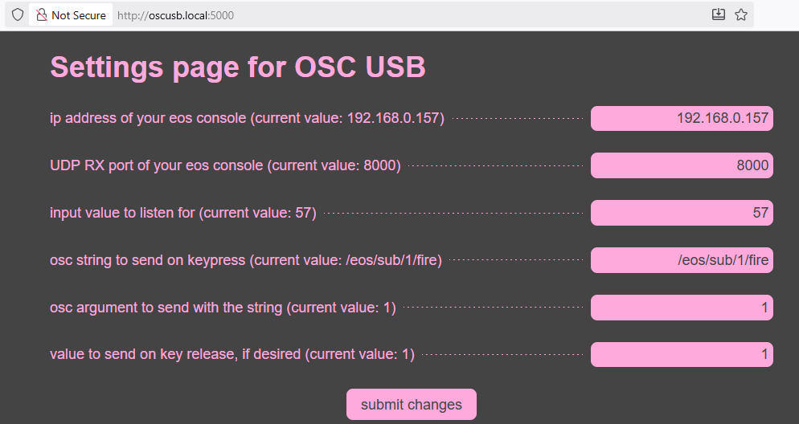

utility to accept keyboard input and translate to osc over network

# tips and tricks
for simple fader control, you can use `/eos/fader/p/n/fire` where `p` is your fader page and `n` is your fader number on that page. Fire denotes that it will act as though accessing the bump button, rather than setting a level directly.
You could also use `/eos/sub/n/fire` for the same effect, depending whether prefer to be keyed to a sub or a fader.
Depending whether you want a momentary button or a latch (`Man` or `Hold` respectively, in eos), you can simply include or not include a release value. If you leave the release value field blank, it will function as a latch - `Hold`. If you include the value `1` on key release, it will fire a second time, and function as a momentary button - `Man`.
If you use a [BetterGoButton](https://bettergobutton.com/), note that for any holding capability, you will have to change the button function to a key (e.g. the space bar) instead of the macro that they have included. For this case, you actually want to keep sending the keypress if you hold it down. Their website includes [instructions on how to change your BetterGoButton settings](https://bettergobutton.com/index.php/customize/).

If you want to use this for a `Go` button, use `/eos/key/go 0`, with an osc argument of `1` and a blank key release field. This will only send the g-o once per key press. (If for some reason you want to g-o on press and release, you can set 1 as your key release value. I don't know why you would want this.)

# download/run notes
you'll need a python3 virtual environment. after setting this up ( `virtualenv -p python3 venv` ) and enabling it ( `. venv/bin/activate` ), make sure to download the requirements! `pip install -r requirements.txt`
for testing at home, you can then `flask run -h '0.0.0.0'` to start the application. access by ip or hostname

# deployment
you will want to set up your raspberry pi (or other computer) to run this application at boot, to enable easy headless deployment. this is beyond the scope of this readme.

# NOTES
* if you delete a field from `settings.json`, the application won't know how to recover, as it relies on the existing json to populate the settings page. i recommend downloading (or referencing) `settings.json` from this repository if yours gets corrupted.
* this application requires python-libinput v0.3, not currently on pypi  
git+https://github.com/OzymandiasTheGreat/python-libinput.git#egg=python-libinput